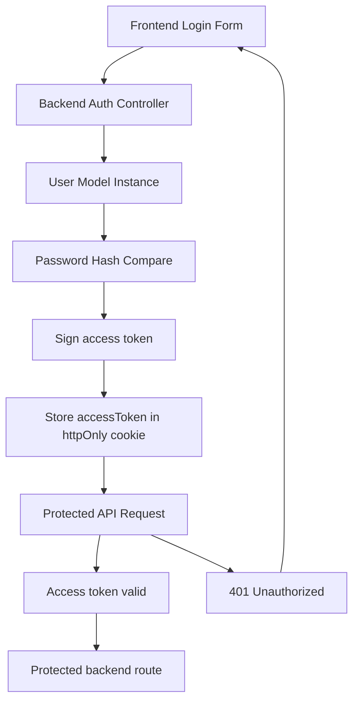

# JWT Authentication Flow

This diagram shows the full frontend-to-backend authentication flow.

## Flow Explanation

- `accessToken`: a short-lived JWT (15 minutes) stored in a secure `httpOnly` cookie.
- `authMiddleware`: verifies the cookie token on every protected request.
- This example uses cookies instead of client-side storage.
- In production, prefer `httpOnly` secure cookies and CSRF-safe request handling for JWT auth.
